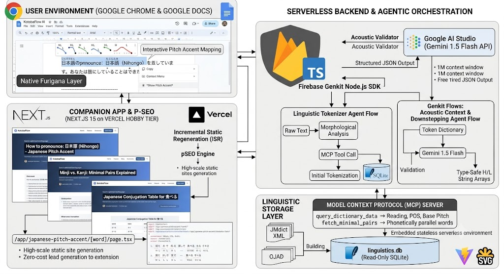

# KotobaFlow AI (言葉フロー) 🚀

A production-grade, serverless Manifest V3 Chrome Extension and Programmatic SEO companion web application that serves as an advanced linguistic assistant for learners of Standard Japanese (標準語). 

**KotobaFlow AI** delivers real-time, context-aware Furigana generation and interactive pitch accent contour mapping natively inside Google Docs—operating entirely within 100% free cloud tiers.

---

## 🌟 Key Features

* **Native Google Docs Furigana Layer:** Automatically processes Japanese text on screen and dynamically injects readable Furigana overlays above structural Kanji words.
* **Contextual Pitch Accent Analysis:** Highlight any Japanese phrase, right-click, and select *"Show Pitch Accent"* to render an explicit, high/low pitch contour mapping over every individual mora.
* **Acoustic Downstepping Resolution:** Uses generative AI workflows to dynamically resolve real-world phonetic shifts, particle attachments, and verbal conjugation pitch modifications ($kifuku$).
* **Programmatic SEO Companion Platform:** A high-scale, ultra-fast Next.js directory that automatically serves thousands of search-optimized landing pages targeting long-tail language learning keywords to drive extension installs at zero cost.

---

## 🏗️ Architecture Blueprint

The system is designed as a decoupled, multi-tier serverless system maximizing efficiency to operate at exactly **$0.00 infrastructure cost**:



```
kotobaflow-monorepo/
├── package.json                    # Workspace configurations (npm/pnpm/yarn)
├── README.md                       # The comprehensive project manual
│
├── apps/
│   ├── chrome-extension/           # 1. CHROME EXTENSION LAYER
│   │   ├── manifest.json           # Extension Manifest V3 configuration
│   │   ├── package.json
│   │   ├── vite.config.ts          # Fast bundling configuration
│   │   ├── src/
│   │   │   ├── background/
│   │   │   │   └── index.ts        # Service worker, right-click context menu handler
│   │   │   ├── content/
│   │   │   │   ├── furigana.ts     # Google Docs surface monitoring & overlay injection
│   │   │   │   └── overlay.ts      # Shadow DOM canvas wrapper for SVG pitch graphs
│   │   │   └── shared/
│   │   │       └── types.ts        # Client-side messaging interface definitions
│   │   └── public/
│   │       └── icons/              # Extension brand asset sizes (16, 48, 128)
│   │
│   └── web-companion/              # 2. NEXT.JS P-SEO COMPANION WEB APP
│       ├── package.json
│       ├── next.config.ts          # Next.js configuration (TypeScript)
│       ├── postcss.config.mjs      # PostCSS configuration for Tailwind v4
│       └── src/
│           └── app/
│               ├── layout.tsx      # Core shell, SEO tags, global styles
│               ├── page.tsx        # Dynamic high-conversion landing page
│               └── japanese-pitch-accent/
│                   ├── page.tsx    # Index/Hub list of words for web crawler mapping
│                   └── [word]/
│                       └── page.tsx # Core Programmatic SEO template page (ISR)
│
├── packages/
│   ├── backend-core/               # 3. GENKIT & MCP SERVERLESS CLOUD LAYER
│   │   ├── package.json
│   │   ├── genkit.config.ts        # Firebase Genkit and Gemini initialization
│   │   ├── src/
│   │   │   ├── index.ts            # Core API Gateway / Serverless entry point
│   │   │   ├── agents/
│   │   │   │   ├── tokenizer.ts    # Agent 1: Structural Morphology & MCP linking
│   │   │   │   └── acoustic.ts     # Agent 2: Gemini 1.5 Flash Downstepping resolver
│   │   │   └── mcp/
│   │   │       ├── server.ts       # TypeScript MCP Server instance
│   │   │       └── tools.ts        # Custom database search tools
│   │   └── data/
│   │       └── linguistics.db      # The centralized 100MB read-only SQLite binary
│   │
│   └── shared-utils/               # 4. TRANSVERSAL SHARED UTILITIES
│       ├── package.json
│       └── src/
│           └── pitch-parser.ts     # Common logic for rendering H/L strings to SVG coordinates
```
---

## 🛠️ Required Technical Stack

* **Extension Frontend & Core:** Manifest V3 Browser Extension API, TypeScript, Vite, SVG Core Vector Engines.
* **Agentic Orchestration:** Firebase Genkit Node.js SDK (Structured JSON Outputs, Tool Augmentation).
* **AI Engine / LLM:** Google AI Studio (Gemini 1.5 Flash 
API — 1M context window, high Japanese contextual fluency).
* **Integration Layer:** Model Context Protocol (MCP) TypeScript SDK.
* **Linguistic Storage:** Optimized Read-Only SQLite database (`linguistics.db` built from raw open-source JMdict XML & Online Japanese Accent Dictionary datasets).
* **Companion App & P-SEO:** Next.js 16 (App Router), TailwindCSS v4, Incremental Static Regeneration (ISR), deployed via Vercel Hobby Tier.

---

## 🧠 Multi-Agent System Framework

KotobaFlow utilizes decoupled, cooperative AI workflows inside **Genkit Flows** to maintain strict execution rules:

### 1. Linguistic Tokenizer Agent
* **Objective:** Ingests raw text selections from the background service worker, executes morphological analysis, and isolates grammatical markers.
* **Action:** Triggers the custom MCP Tool `query_dictionary_data` to access the read-only SQLite database instance, instantly pairing text elements with their baseline dictionary values and deep phonological classes.

### 2. Acoustic Context & Downstepping Agent
* **Objective:** Resolves real-world inflection shifts (such as a flat *Heiban* noun mutating under a dependent particle structural link).
* **Action:** Feeds structured token dictionaries into Gemini 1.5 Flash using strict structural prompt guidelines. The LLM acts as an acoustic validator, returning an absolute, type-safe array mapping every single mora to a High (`H`) or Low (`L`) pitch state.

---

## 🛰️ Model Context Protocol (MCP) Integration

The project bypasses expensive cloud database reads by embedding a relational SQLite file inside a stateless, serverless environment. A tailored MCP Server exposes key tools:

* `query_dictionary_data(surfaceForm: string)`: Queries local indexed dictionary tables for readings, part-of-speech context, and base pitch indices.
* `fetch_minimal_pairs(baseMoraCount: number)`: Returns phonetically parallel words with differing pitch configurations to serve the Programmatic SEO layer.

---

## 🎨 Interactive Pitch Accent UI Rendering

The Extension UI parses the `H`/`L` string arrays produced by the agentic pipeline, drawing explicit graphic steps via optimized vector inline SVGs:

<svg class="pitch-contour" viewBox="0 0 300 50" style="width: 100%; height: auto;">
  <path d="M 0 10 L 100 10 L 100 40 L 300 40" fill="none" stroke="#4F46E5" stroke-width="3"/>
  <circle cx="50" cy="10" r="4" fill="#4F46E5" />
  <circle cx="150" cy="40" r="4" fill="#4F46E5" />
  <circle cx="250" cy="40" r="4" fill="#4F46E5" />
</svg>

## 📈 Programmatic SEO Architecture
The Next.js companion app functions as a high-intent user acquisition pipeline by dynamically mapping out the entire open-source dictionary dataset using explicit Incremental Static Regeneration (ISR):

File-Based Routing Path: app/japanese-pitch-accent/[word]/page.tsx

Optimization Engine: export const dynamic = 'force-static'; with an aggressive revalidate = 604800; lifecycle flag.

Mechanics: Vercel generates targeted lexical landing pages on-demand. When search engine bots crawl the thousands of localized keyword paths, the pages display pre-computed static views with minimal execution costs, embedding high-conversion download links for the Chrome Extension.

## 🔒 Strict Budget & Zero-Cost Declarations
This system is mathematically and structurally configured to run completely free of charge:

Google AI Studio: Free tier covers up to 15 Requests Per Minute (RPM), perfectly scaling for personal validation and user workloads.

Vercel Serverless & Hosting: Leverages the free Hobby tier by offloading database compute into static compile-time file queries and client-side extensions.

Firebase Genkit: Open-source framework logic executing strictly within standard application execution cycles without specialized host fees.